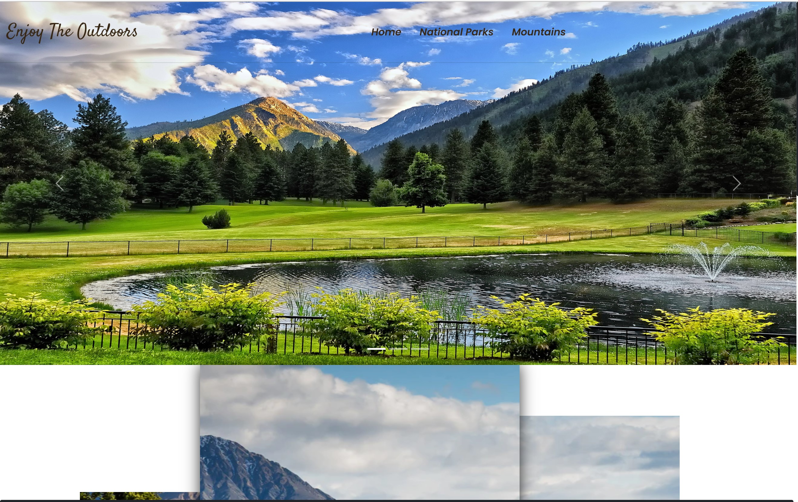
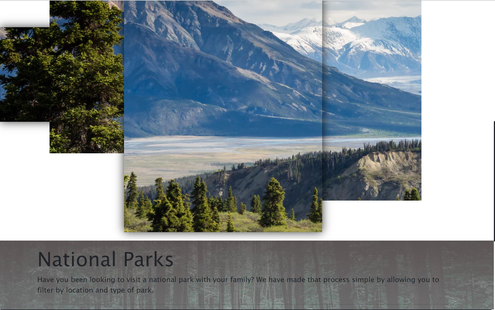
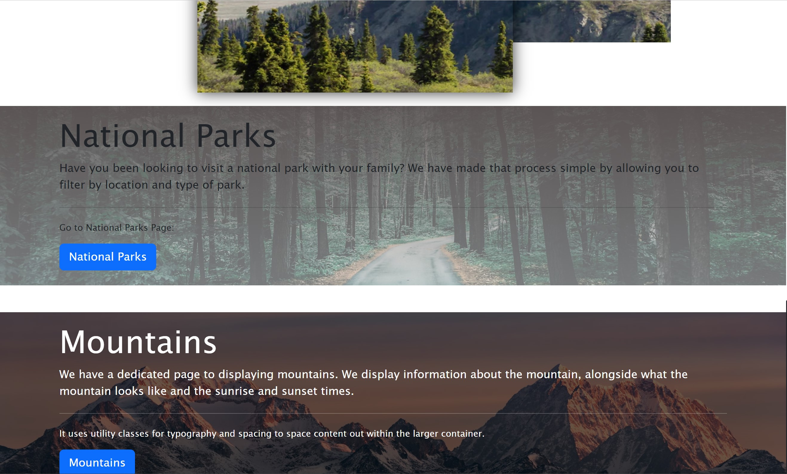
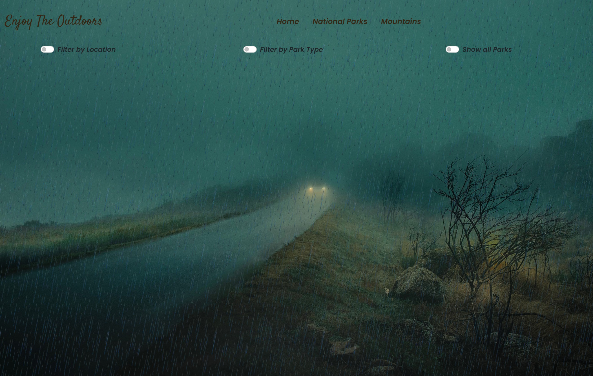
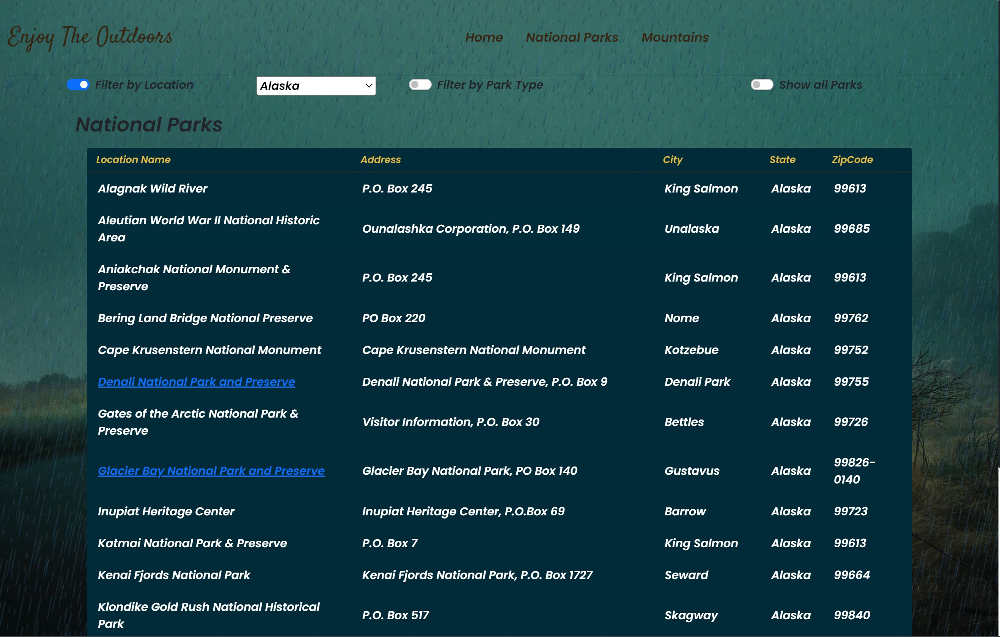
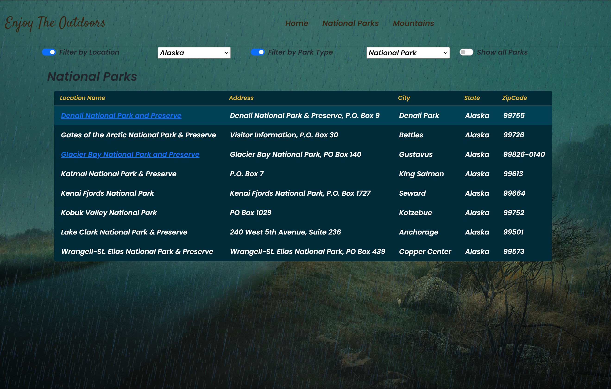
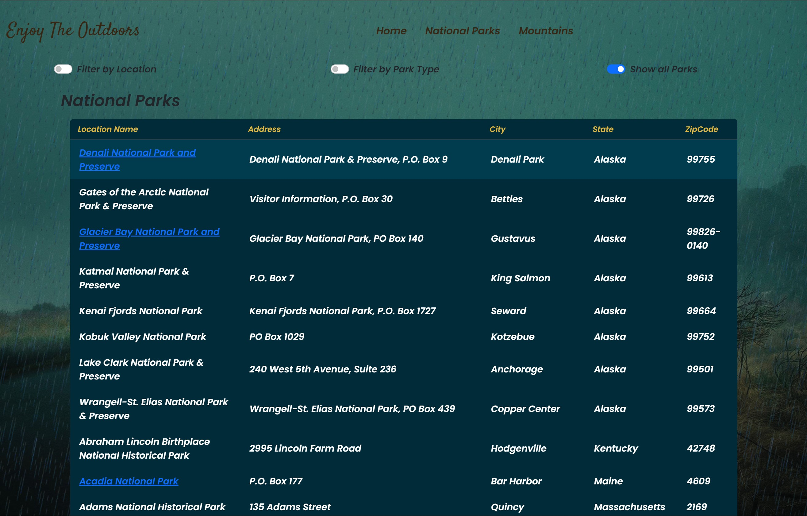
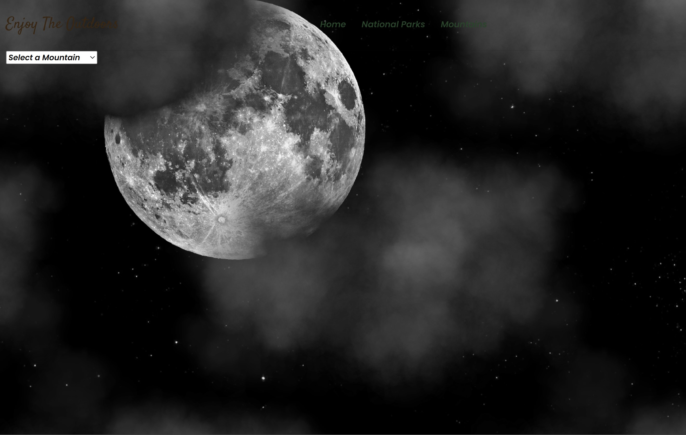
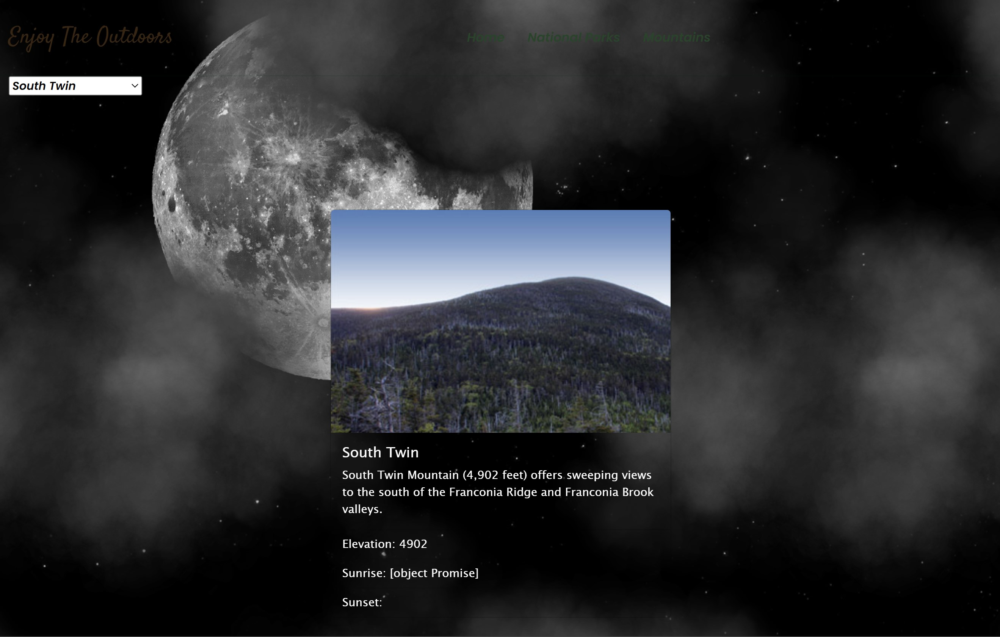

# EnjoyTheOutdoors
The purpose of this project was to create pages from data we received and display that data in a user friendly way. The project contains three pages, a Homepage, National Parks page, and a Mountains page.
---
1.**Homepage**
In the homepage we are looking to create an introduction for the user to our site and explain the purpose of our site as well as have links that can help the user naviagate to what they are looking for.

---
2.**National Parks**
In the National Parks page we are allowing the user to filter through different national Parks using location,park type, or they can choose to display all the national parks. The data is then filtered and displayed in a table with the name, address, and if present a link to the national park that has more information.

---
3.**Mountains**
Our Mountains page simply allows the user to choose a mountain for the choices and displays the name, description, image, sunrise, and sunset or that mountain. 

---